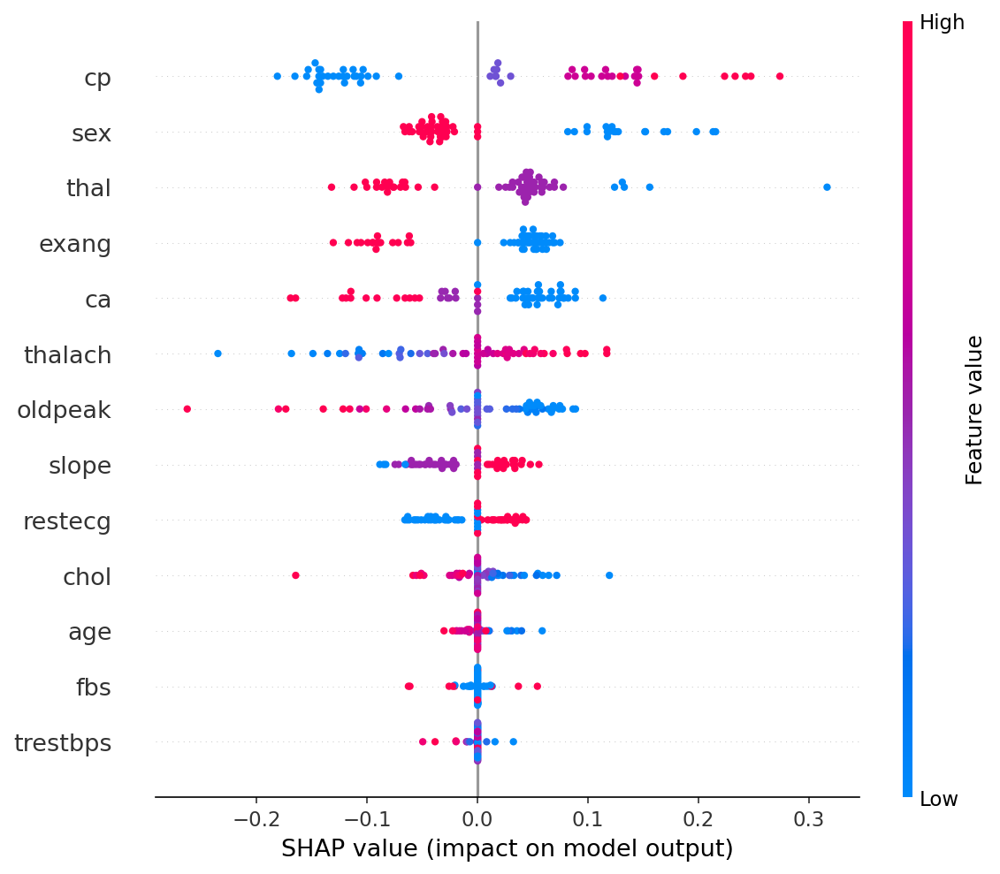
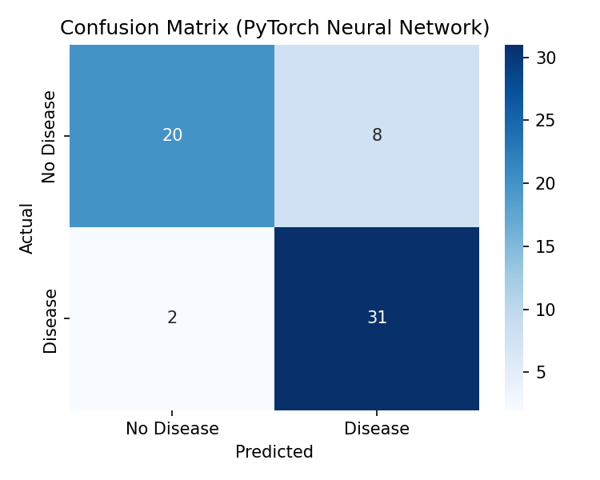
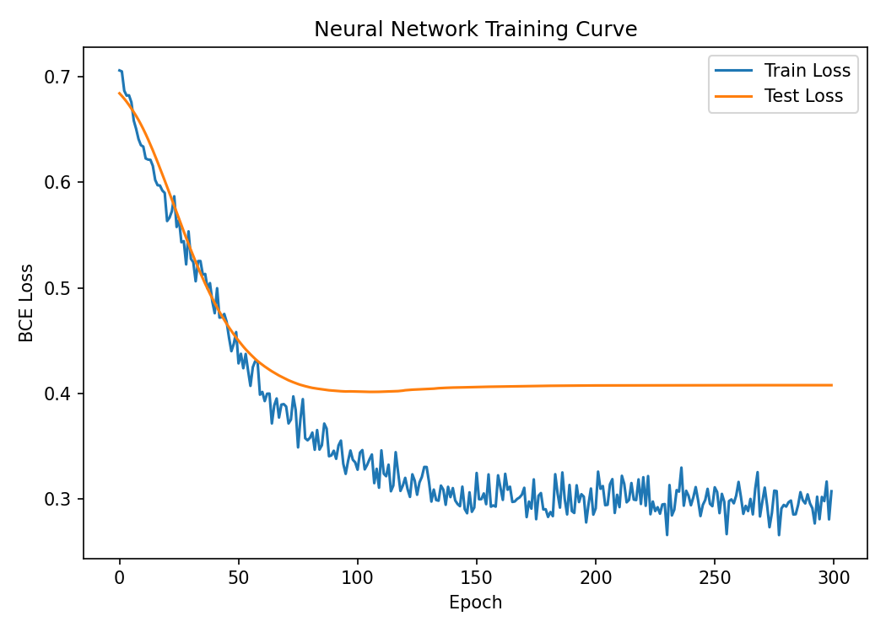

# Heart Disease Prediction using Machine Learning

Supervised ML pipeline for cardiovascular disease risk prediction on the
benchmark **UCI Heart Disease (Cleveland)** dataset — 303 patients, 13
clinical features, binary target (presence/absence of heart disease).

## Approach

- **Preprocessing:** stratified train/test split (80/20) performed *before*
  scaling to avoid data leakage, then `StandardScaler` fit on the training
  fold only.
- **Models compared:** Logistic Regression, Random Forest, SVM (RBF kernel),
  and a custom PyTorch feed-forward neural network (2 hidden layers,
  batch norm + dropout, trained with `BCEWithLogitsLoss` and an
  Adam optimizer with LR scheduling / early-stopping on validation loss).
- **Interpretability:** SHAP `KernelExplainer` applied to the neural
  network's predictions to identify which clinical features drive
  individual risk scores.

## Results

| Model | Accuracy | F1 | Precision | Recall | ROC-AUC |
|---|---|---|---|---|---|
| Logistic Regression | 80.3% | 0.833 | 0.769 | 0.909 | 0.869 |
| Random Forest | 82.0% | 0.853 | 0.762 | 0.970 | 0.908 |
| SVM (RBF) | 82.0% | 0.849 | 0.775 | 0.939 | 0.883 |
| **PyTorch Neural Network** | **83.6%** | **0.861** | 0.795 | 0.939 | 0.895 |

The neural network was the best performer on this split. Note the test set
is only 61 patients, so each additional correct prediction moves accuracy
by ~1.6 points — results should be read as "low-to-mid 80s%", not as a
precise fixed number, and will shift a little with a different
train/test split or random seed.

### SHAP feature importance

The top features by mean |SHAP value| were **chest pain type (`cp`)**,
**sex**, **thalassemia (`thal`)**, **exercise-induced angina (`exang`)**,
and **number of major vessels (`ca`)** — consistent with established
cardiology literature on heart disease risk factors, which is a good
sanity check that the model is learning real signal rather than noise.





## Dataset

UCI Machine Learning Repository — [Heart Disease Dataset](https://archive.ics.uci.edu/dataset/45/heart-disease)
(Cleveland Clinic Foundation, Robert Detrano et al.). 303 instances, 13
features, no missing values in this processed version.

## Tech stack

Python, scikit-learn, PyTorch, SHAP, pandas, matplotlib, seaborn

## Running it

```bash
pip install -r requirements.txt
python train.py
```

Outputs: trained model weights (`heart_net.pt`), scaler (`preprocessing.pkl`),
metrics (`results.json`, `model_comparison.csv`), and all plots.

## Project structure

```
heart-disease-prediction/
├── train.py              # full pipeline: data -> 4 models -> SHAP
├── heart_raw.csv          # UCI Heart Disease (Cleveland) dataset
├── requirements.txt
├── results.json
├── model_comparison.csv
├── shap_summary.png
├── confusion_matrix.png
└── loss_curve.png
```
